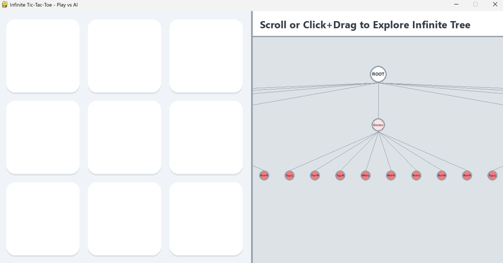
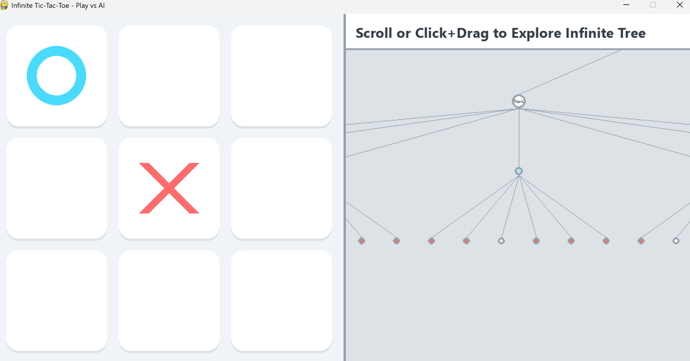
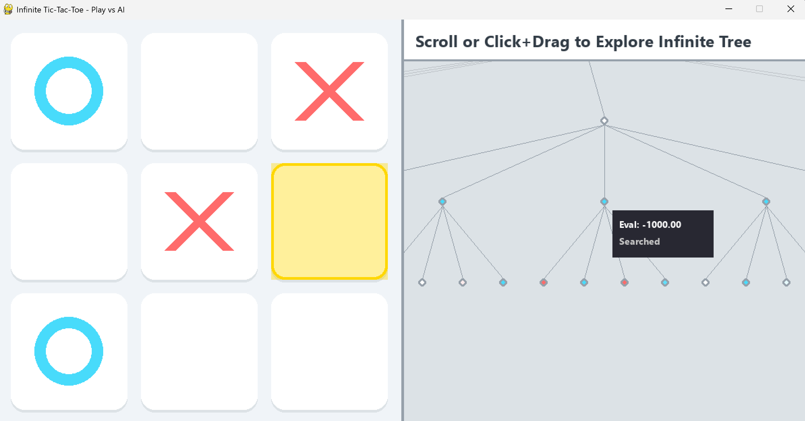

# Infinite Tic-Tac-Toe ⚔️

<p align="center">
  
  
  
</p>

Welcome to **Infinite Tic-Tac-Toe**! This project is a modern, mathematically rigorous take on the classic game, complete with an interactive Minimax Game-Tree visualizer and a highly optimized AI opponent.

## Rules of the Game
Unlike traditional Tic-Tac-Toe where games often end in a draw, **Infinite Tic-Tac-Toe forces a winner.**
1. Players ('X' and 'O') take turns placing their pieces on a standard 3x3 grid.
2. **The Catch:** Each player is only allowed to have **3 pieces** on the board at any given time.
3. When a player legally places their 4th piece on the board, their **oldest piece instantly vanishes**. (This allows the game to continue infinitely until someone secures 3 pieces in a row).

## Features & Scripts

This repository contains 3 distinct ways to experience the game:

### 1. The Classic Game & Interactive Visualizer (`main.py`)
This is the base playable version of the game. It is a **2-Player Local Hotseat** mode where two friends can play against each other on the same keyboard by clicking for both X and O. 
It features a split-screen design:
*   **Left Half:** The interactive, clickable 3x3 game board. Pieces slowly fade out when they are "old" to warn you that they will disappear on your next turn.
*   **Right Half:** The **Infinite Tree Graph Explorer**. 
    *   This is a scrollable, zoomable UI element that visually renders every single possible move currently available on the board.
    *   **Controls:** Use your **Mouse Scroll Wheel** to seamlessly Zoom In/Out. **Click & Drag** to pan the camera around the massive tree. 
    *   **Hover Highlights:** Hover your mouse over any glowing node in the tree to project a gold square onto the physical game board, showing you what move that node represents.

### 2. The AI Engine (`engine.py`)
A standalone, highly-optimized AI engine designed specifically to play this variant of the game. It uses advanced chess programming techniques:
*   **Minimax with Alpha-Beta Pruning:** To mathematically trim bad branches and see deeper into the future, faster.
*   **Iterative Deepening & Time Limits:** The engine searches Layer 1, then Layer 2, then Layer 3... until a strict time limit is reached, ensuring it always returns its smartest move without freezing the game.
*   **Dynamic Depth Scaling:** When the board is empty, it searches a shallow depth. Once the game reaches the Infinite Phase (3 pieces each), the engine realizes there are fewer options and aggressively scales its search depth to see **12 moves into the future**.
*   **Temporal Evaluation:** If the engine can't find a forced win/loss, it grades the board. It actively penalizes "good" board positions if it calculates that the piece securing that position is the oldest piece and is about to vanish!

### 3. Play vs AI Mode (`play.py`)
This is the ultimate version of the project. It merges the UI of `main.py` with the brain of `engine.py`.
*   You play as 'X', the Engine plays as 'O'.
*   As you play, the Tree Graph on the right generates the future moves, but **uses the Engine's Minimax score to Grade every single node**. 
*   **Hover Feature:** If you hover your mouse over any node in the Tree Graph on the right, it will project a glowing **Gold Square** onto the physical game board on the left so you know exactly what move that node represents!

## How to Run

Ensure you have Python and Pygame installed:
```bash
pip install pygame
```

To test the raw mathematical engine in the terminal:
```bash
python engine.py
```

To play 2-Player Local Hotseat with the interactive tree:
```bash
python main.py
```

To play against the AI Engine using the fully interactive Tree UI:
```bash
python play.py
```

Enjoy exploring the Infinite Tree!
